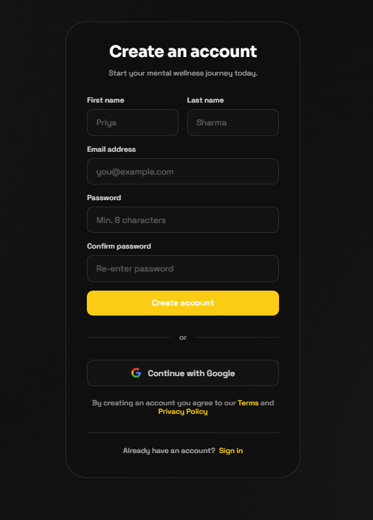
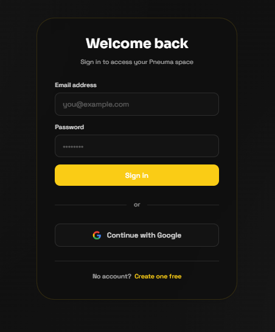
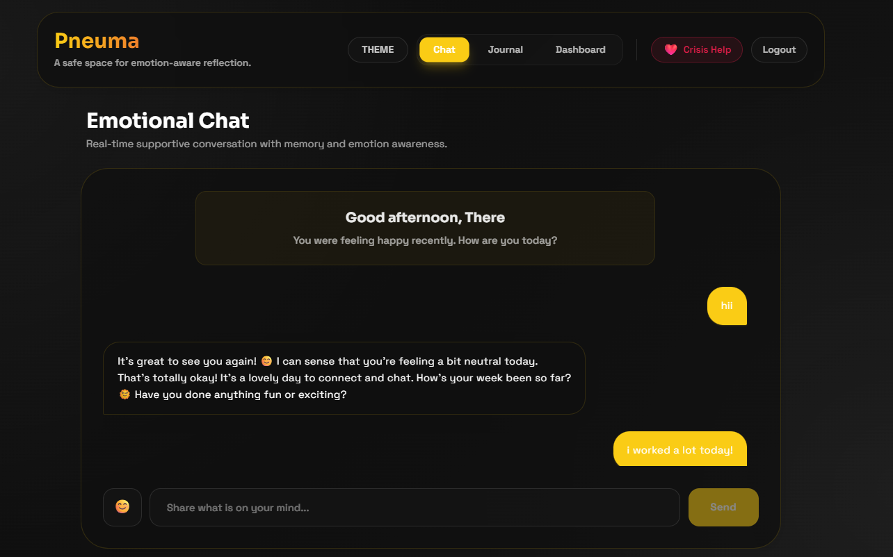
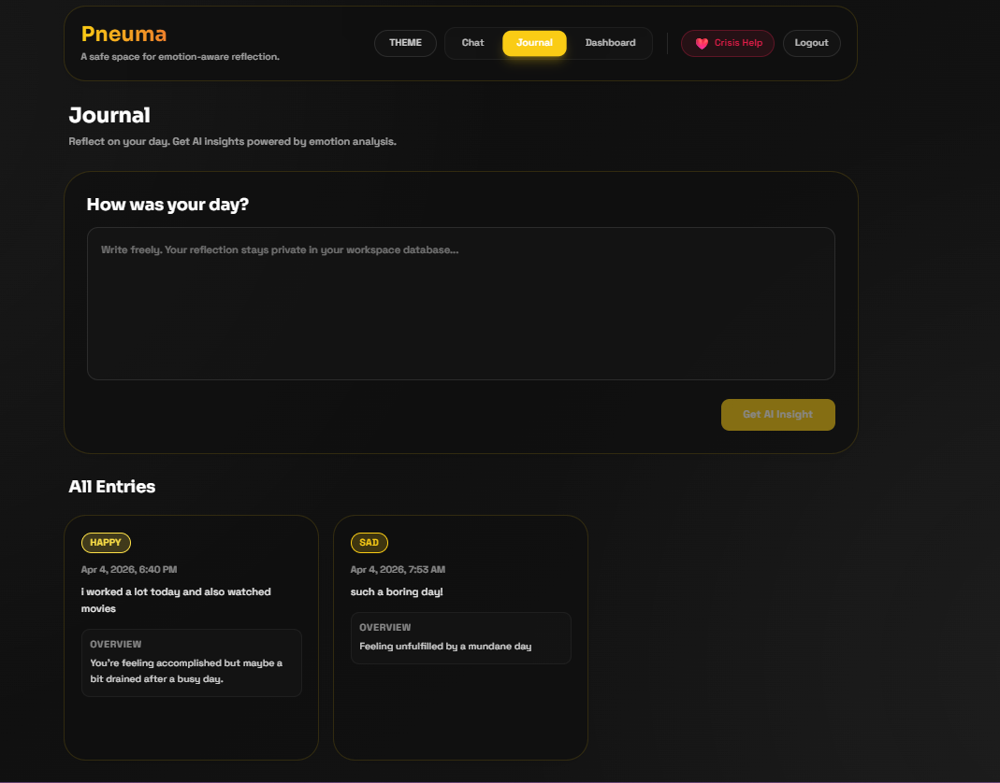
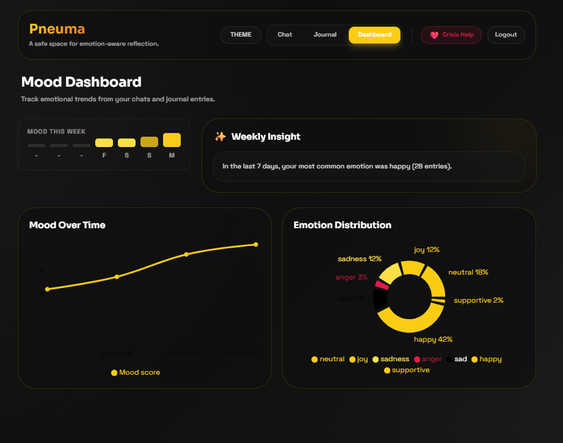

# Pneuma: Mental Wellness AI Chat & Journal Platform

A full-stack mental wellness application combining emotion-aware AI conversations, journaling with AI-generated insights, mood analytics, and crisis intervention protocols.

**Live:** https://mental-wellness.duckdns.org/

---

## Features

### 🗣️ Emotion-Aware AI Chat
- Real-time chat with emotionally intelligent AI responses
- Automatic emotion detection using Hugging Face Transformers
- Context-aware conversations with memory of previous interactions
- AI responses powered by Groq (LLaMA inference)
- Crisis detection with emergency helpline resources

### 📔 Smart Journaling
- Write private journal entries with automatic AI analysis
- Three-fold analysis for each entry:
  - **Summary**: What you wrote
  - **Insight**: Psychological patterns & underlying themes
  - **Suggestion**: Actionable, personalized advice

### 📊 Emotional Analytics Dashboard
- **7-Day Mood Tracker**: Color-coded severity visualization of mood trajectory
- **Line Chart**: Track overall mood trends over time
- **Pie Chart**: Emotional distribution analysis
- **Weekly Insight**: AI-generated summary of emotional patterns
- Real-time mood scoring based on detected emotions

### 🎨 Premium Theme System
- Four instantly-switchable UI themes:
  - Midnight Gold
  - Ocean Glow
  - Sunset Aura
  - Aurora Neon
- Dynamic CSS variable system for seamless theme transitions

### 🔐 Security & Authentication
- JWT-based authentication with refresh token rotation
- Secure password hashing with bcrypt
- OAuth 2.0 support (Google, GitHub)
- Session management with 24-hour auto-logout

### 🗄️ Data Persistence
- PostgreSQL database with pgvector support for semantic search
- Vector embeddings for message similarity detection
- Efficient mood log aggregation and analytics
- Automatic backup system

---

## How It Works

### Authentication Flow
1. User registers/logs in via glassmorphic Auth screen
2. Backend generates secure JWT token pairs
3. All subsequent API requests authorized via tokens

### Chat Workflow
1. **User Input**: Message sent to API
2. **Safety Check**: Screens for crisis keywords (self-harm, suicide)
   - If detected: Immediate redirect to emergency resources & Indian mental health helplines
3. **Emotion Detection**: DistilRoBERTa model classifies user's emotional state
4. **Context Retrieval**: Previous 10 messages with embeddings retrieved for continuity
5. **AI Response**: LangChain + Groq generates empathetic, contextual response
6. **Rendering**: Response displayed with theme-aware styling

### Journal Workflow
1. User writes long-form entry
2. Backend analyzes entry via LLM:
   - Extracts emotion
   - Generates summary, insight, and personalized suggestion
3. Analysis stored with emotional metadata
4. Emotion logged for dashboard analytics

### Analytics Pipeline
1. Every chat/journal interaction logs emotion to `mood_logs`
2. Dashboard aggregates logs by date and emotion type
3. Mood scores calculated (1-5 scale based on emotion intensity)
4. Charts render real-time visualizations
5. Weekly summary generated from last 7 days of data

### Crisis Protocol
- Real-time keyword detection for crisis indicators
- Immediate response with emergency resources
- Visual crisis modal with Indian mental health helplines:
  - AASRA: 9820466726
  - iCall: 9152987821
  - Vandrevala Foundation: 9999 666 555
- No LLM delay - safety-first response

---

## Technology Stack

**Backend**
- FastAPI (async REST API)
- SQLAlchemy (ORM)
- PostgreSQL (relational database)
- pgvector (semantic search)
- Transformers (emotion detection)
- LangChain (LLM orchestration)
- Groq API (LLaMA inference)

**Frontend**
- React + Vite (SPA)
- Tailwind CSS (styling)
- Recharts (analytics)
- Axios (HTTP client)

**DevOps**
- GitHub Actions (CI/CD auto-deployment)
- Nginx (reverse proxy)
- Gunicorn (WSGI server)
- Let's Encrypt (SSL/TLS)

---

## API Endpoints

| Method | Endpoint | Purpose |
|--------|----------|---------|
| POST | `/auth/register` | User registration |
| POST | `/auth/login` | User login |
| POST | `/chat` | Send message & get AI response |
| GET | `/chat/history` | Get chat message history |
| POST | `/journal` | Submit journal entry |
| GET | `/journal` | Get all journal entries |
| GET | `/mood` | Get mood analytics & dashboard data |
| GET | `/health` | Service health check |

---

## Screenshots

### 🔐 Authentication

  
  

**Sign Up & Sign In** - Glassmorphic authentication screens with Google OAuth integration

### 💬 Emotional Chat

**Real-time AI Chat** - Emotion-aware conversations with memory and contextual responses

### 📔 Journaling with AI Insights

**Smart Journal** - Write entries and receive AI-generated summaries, insights, and personalized suggestions

### 📊 Mood Analytics Dashboard

**Emotional Analytics** - Track mood trends with 7-day tracker, line charts, emotion distribution pie chart, and weekly insights

---
